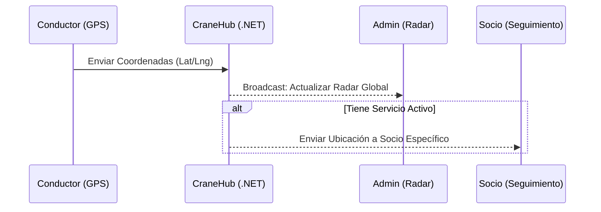

# 🏗️ CraneFlow - Sistema de Gestión de Auxilio Mecánico Táctico

CraneFlow es una plataforma de alta gama diseñada para la orquestación en tiempo real de servicios de grúas y auxilio mecánico. Implementa una arquitectura robusta, segura y escalable basada en micro-servicios contenerizados y comunicación satelital simulada mediante SignalR.

---

## 🛰️ Arquitectura del Sistema (Clean Architecture)

El proyecto sigue los principios de **Domain-Driven Design (DDD)** y **Clean Architecture**, asegurando que la lógica de negocio esté aislada de las preocupaciones de infraestructura.

### 🏙️ Capas del Proyecto (C# .NET 8)
*   **Domain**: Entidades puras y lógica de negocio. Sin dependencias externas.
*   **Application**: Casos de uso (Request/Accept/Track), DTOs y lógica de SignalR.
*   **Infrastructure**: Acceso a datos con **Dapper**, ejecución de Stored Procedures en SQL Server y Logging.
*   **API**: Endpoints RESTful y el Hub central de comunicaciones (`CraneHub`).

### 🎨 Frontend (React + Vite + Tailwind)
*   Sistema de mapas reactivo con **Leaflet**.
*   Estado global gestionado con **Zustand**.
*   Hooks personalizados para telemetría continua.

---

## 📡 Deep Dive: Funcionamiento de SignalR y Telemetría

La joya de la corona del sistema es su capacidad de rastreo en tiempo real. Aquí explicamos cómo fluye la información:

### 🔄 Flujo de Ubicación en Tiempo Real
1.  **Emisión (Conductor)**: El navegador del conductor usa la API de Geolocalización (`watchPosition`). Cada vez que el GPS detecta un movimiento, el Hook `useSignalR` dispara el método `ActualizarUbicacion` al servidor.
2.  **Procesamiento (Hub)**: El `CraneHub` en el Backend recibe la latitud/longitud y el ID del conductor.
3.  **Difusión (Broadcast)**: 
    *   Si el conductor está en un servicio activo, la ubicación se envía **específicamente al socio** asignado.
    *   Simultáneamente, la ubicación se envía al grupo de **Administradores** para actualizar el radar global.
4.  **Recepción (Admin/Socio)**: Los componentes de mapa en el Frontend reciben las coordenadas y actualizan la posición de los marcadores con micro-animaciones CSS, evitando saltos bruscos.



---

## 🚀 Despliegue en Producción (Docker)

El sistema opera bajo un entorno de contenedores orquestado por **Docker Compose**, lo que garantiza paridad total entre desarrollo y producción.

### 🐳 Contenedores en Ejecución
*   **`craneflow-db`**: MS SQL Server 2022. Puerto interno 1433 (no expuesto al exterior por seguridad).
*   **`craneflow-api`**: Backend .NET 8. Escucha internamente y es servido por el Nginx del Host.
*   **`craneflow-web`**: React servido por un Nginx interno (Alpine), diseñado para máxima velocidad de carga.

### 🛡️ Seguridad y Proxy Reverso (Nginx)
El tráfico externo llega a través del **Nginx del VPS Host**, el cual se encarga de:
1.  **Terminación SSL**: Gestión de certificados **Let's Encrypt** (HTTPS).
2.  **Websocket Proxying**: Permite que las conexiones `WSS` (Secure WebSockets) de SignalR no se rompan.
3.  **Firewall**: Solo los puertos 80 y 443 están abiertos. La base de datos está blindada dentro de la red interna de Docker (`craneflow-net`).

---

## 🛠️ Guía de Mantenimiento Rápido

### Ver Logs de Producción
```bash
cd /var/www/CraneFlow
docker compose logs -f --tail 50 backend # Ver actividad del API y SignalR
docker compose logs -f db                # Ver actividad de SQL Server
```

### Actualizar el Código
Si haces cambios en GitHub y quieres desplegarlos:
```bash
git pull origin main
docker compose up --build -d
```

---

## 🏆 Estándares de Calidad
*   **Clean Code**: Nomenclatura en español para variables de negocio, siguiendo las directrices de `GEMINI.md`.
*   **UX Premium**: Dark mode por defecto, rutas calculadas con OSRM y feedback visual instantáneo.
*   **Auditoría**: Todas las acciones en DB guardan usuario, fecha e IP de modificación.

---
*Documentación generada automáticamente para CraneFlow v1.0. ¡Listo para la acción!* 🏁🦾🛰️🏆
